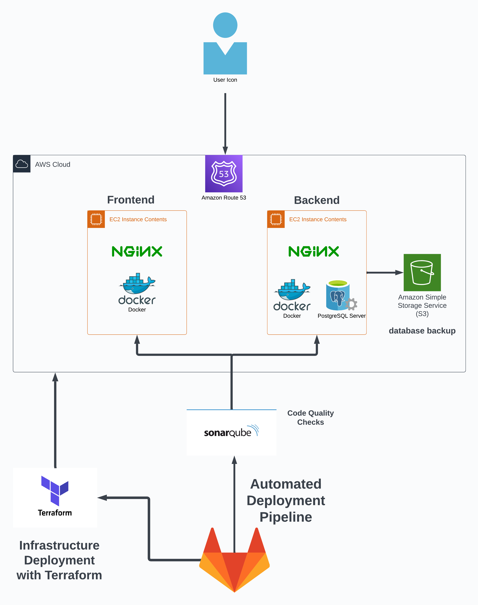

# Welcome to [Retkilyhty](http://www.retkilyhty.fi)!

Retkilyhty is a versatile application that empowers users to easily discover and explore various types of accommodations and points of interest in their area. Whether you're planning a weekend escape, an adventure to a reserved hut, or just curious about nearby attractions, this app has you covered.

**Note:** This project is an ongoing work in progress. We're actively developing additional features and improvements. Feel free to star the repository to stay updated!


## Table of Contents

- [Features](#features)
- [Technologies](#technologies)
- [Installation](#installation)
- [Hosting](#hosting)
- [infrastructure](#Infrastructure)
  
## Features

- View a dynamic map with markers representing a wide range of locations, including cabins, huts, reserved huts, on-shelter huts, attractions, and more.
- Click on a marker to access detailed information about a specific location. You can also check the current weather information for that area.
- Easily search for places by name.
- Ability for users to add new locations directly on the map.
- Locate nearest points of interest nearby with a single button press.
- Enjoy a responsive design for a seamless experience on various devices.

## Technologies

TrailTorch is powered by the following technologies:

- [React](https://reactjs.org/): A JavaScript library for crafting user interfaces.
- [Node.js](https://nodejs.org/): A JavaScript runtime for server-side development.
- [Koa](https://koajs.com/#): A minimalistic web framework for Node.js.
- [Mapbox](https://www.mapbox.com/): A mapping platform offering location-based service APIs.
- [Tailwind CSS](https://tailwindcss.com/): A utility-first CSS framework for quick and stylish app styling.
- [Vite](https://vitejs.dev/): A fast build tool for modern web applications.
- [Recaptcha](https://developers.google.com/recaptcha): A Google service for preventing spam and abuse on your site.
- [Material UI](https://mui.com/): A popular React UI framework providing pre-built components for design.
- [PostGIS](https://postgis.net/): An extension for PostgreSQL that adds support for geographic objects, allowing location queries to be run in SQL.

### Third-Party Data Sources

Retkilyhty leverages data from various sources, including the [Tulikartta](https://www.tulikartta.fi/) API, for  location information, and it integrates with [OpenWeatherMap](https://openweathermap.org/) for up-to-date weather details.

## Installation

To use this app effectively, you'll need an [OpenWeatherMap](https://openweathermap.org/) API key and a [Mapbox](https://www.mapbox.com/) API key. You also can have [Recapcha](https://developers.google.com/recaptcha) key

1. **Clone the repository.**

2. **Backend Setup:**

   - Navigate to the backend directory.
   - Run the following Docker command to start the backend server and database:


 ```bash
  docker-compose -f docker-compose-prod.yml build
 ```
     
     docker-compose -f docker-compose-prod.yml up
  

   - Ensure you have an env file containing PostgreSQL settings.

3. **Frontend Setup:**

   - Navigate to the frontend directory.
   
    

   - Create the Docker image for the frontend:

     ```bash
     docker build -t my-frontend-image -f dockerfile.frontend .
     ```

   - Start the frontend container:

     ```bash
     docker run -p 8000:8000 my-frontend-image
     ```

   - Ensure you have an env file in the frontend directory containing necessary configurations.


## Hosting

TrailTorch is hosted on AWS, ensuring reliable performance and accessibility to users across the globe.

## Infrastructure




## Contributing

Contributions are highly encouraged! If you discover any issues or have suggestions for improvements, please don't hesitate to submit a pull request. Be sure to follow the code of conduct when contributing.

## License

This project is licensed under the MIT License.
